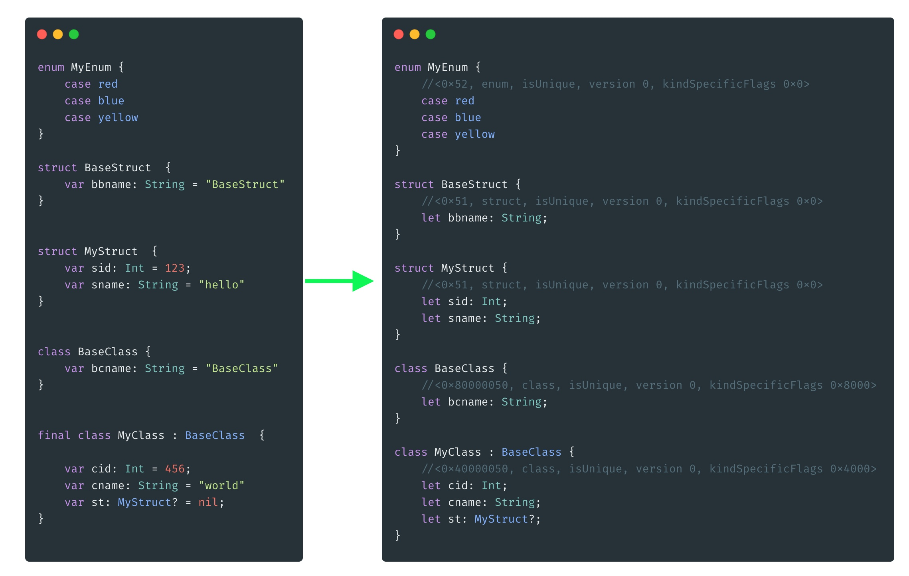
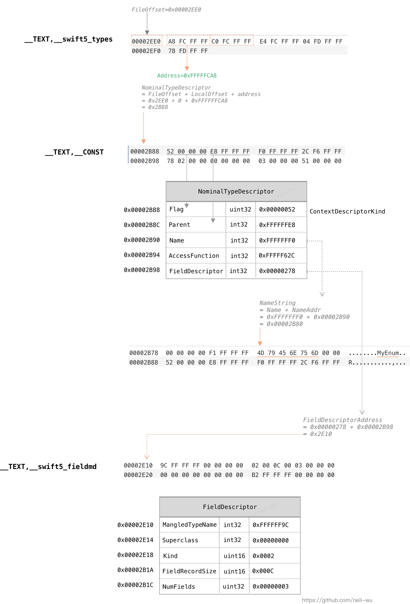

#### SwiftDump

SwiftDump是从Mach-O文件中获取swift对象定义的命令行工具，类似大家都用过的OC类dump工具[class-dump](https://github.com/nygard/class-dump/)，SwiftDump专注于处理swift对象(当前只支持swift 5)。对于采用OC/Swift混编的Mach-O文件，你可以将 class-dump 和 SwiftDump结合起来使用。

同时，我在[Frida](https://www.frida.re/)中实现了一个简单版本 [FridaSwiftDump](https://github.com/neil-wu/FridaSwiftDump/)。

你可以根据需要选择使用，`SwiftDump`可以解析处理Mach-O文件，而`FridaSwiftDump`可以对一个前台运行的app进行解析。

如果你对解析Mach-O的过程感兴趣，请查看该文档最后的配图。



#### 用法

``` Text
USAGE: SwiftDump [--debug] [--arch <arch>] <file> [--version]

ARGUMENTS:
  <file>                  MachO File

OPTIONS:
  -d, --debug             Show debug log.
  -a, --arch <arch>       Choose architecture from a fat binary (only support x86_64/arm64).
                          (default: arm64)
  -v, --version           Version
  -h, --help              Show help information.
```

* SwiftDump ./TestMachO > result.txt
* SwiftDump -a x86_64 ./TestMachO > result.txt

#### 特点

* 完全使用swift编写，项目小巧
* 支持 dump swift 5 的 struct/class/enum/protocol
* 支持解析 enum with payload case
* 支持解析 swift类继承 和 protocol
* 由于采用swift编写，所以借助于swift的运行时函数来还原修饰符(demangle) 比如，`swift_getTypeByMangledNameInContext` 和 `swift_demangle_getDemangledName`

受益于swift运行时函数, SwiftDump可以还原复杂的数据类型, 比如某个使用RxSwift声明的变量类型能达到如下的解析效果： 
`RxSwift.Queue<(eventTime: Foundation.Date, event: RxSwift.Event<A.RxSwift.ObserverType.Element>)>`

#### TODO

* 考虑添加导出函数地址
* 待定

#### Compile

1. Clone the repo
2. Open SwiftDump.xcodeproj with Xcode
3. Modify 'Signing & Capabilities' to use your own id
4. Build & Run

默认输入参数使用目录`Demo/test`的Mach-O文件, 你可以在Xcode里修改输入参数： `Xcode - Product - Scheme - Edit Scheme - Arguments`

(Xcode Version 11.5 (11E608c), MacOS 10.15.5 测试通过)

#### 感谢

* [Machismo](https://github.com/g-Off/Machismo) : 使用swift来读取Mach-O文件
* [swift-argument-parser](https://github.com/apple/swift-argument-parser) : 解析命令行参数
* [Swift metadata](https://knight.sc/reverse%20engineering/2019/07/17/swift-metadata.html) : High level description of all the Swift 5 sections that can show up in a Swift binary.


#### License

MIT


#### Mach-O File Format

下图展示了 SwiftDump 是如何从测试文件 `Demo/test` 解析 swift 类型的，你可以使用 [MachOView](https://github.com/gdbinit/MachOView) 打开这个测试文件，对照下图查看。



